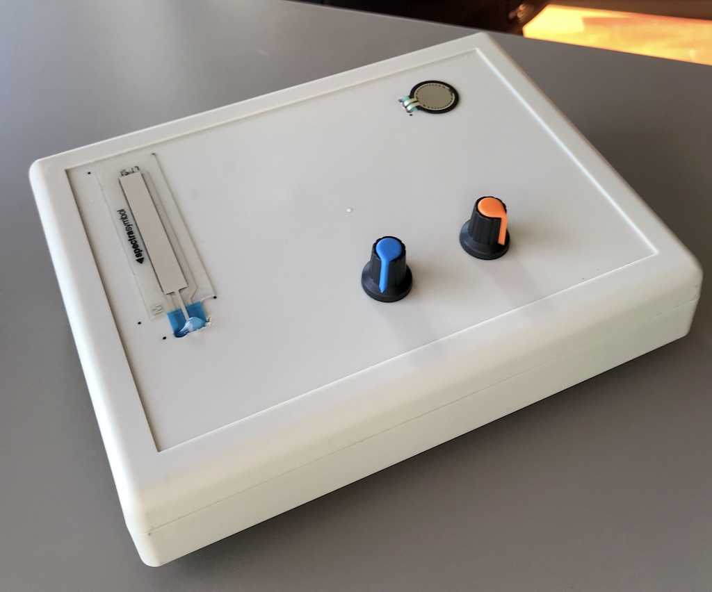

# CCRMA Summer 2019
### Embedded DSP With Faust Workshop

(https://ccrma.stanford.edu/workshops/faust-embedded-19/)[class website]

https://faust.grame.fr/experimental/

## Idea

Explore multiple physical modeling applications for use in Eurorack. Create expressive inputs mapping to model parameters.

## Where I Ended Up

#### Bell Model

A piezo was connected to allow tapping on the body of the instrument to simulate striking a church bell. Faust has physically modeled bells from various churches across Europe.

+ Pot 1 - Input sensitivity
+ Pot 2 - Bell resonation decay time

#### Clarinet Model

Analog inputs were used on the Teensy to read 3 touch inputs.

+ Force Sensitive Resistor 1 - Mouth position on reed
+ Force Sensitive Resistor 2 - Air pressure
+ Softpot - Tube length (pitch)
